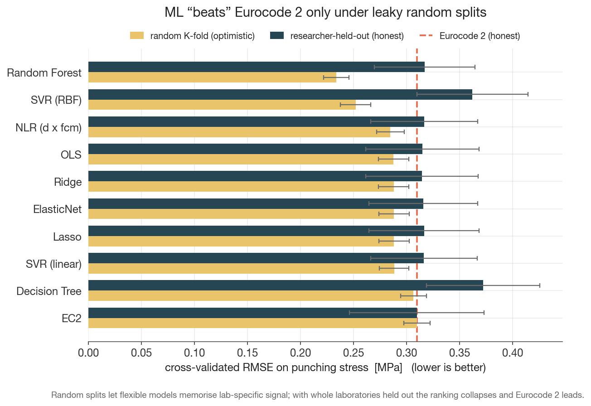
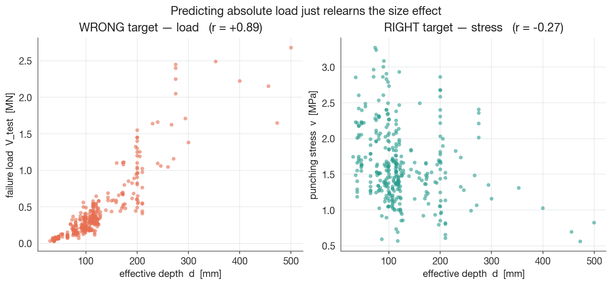
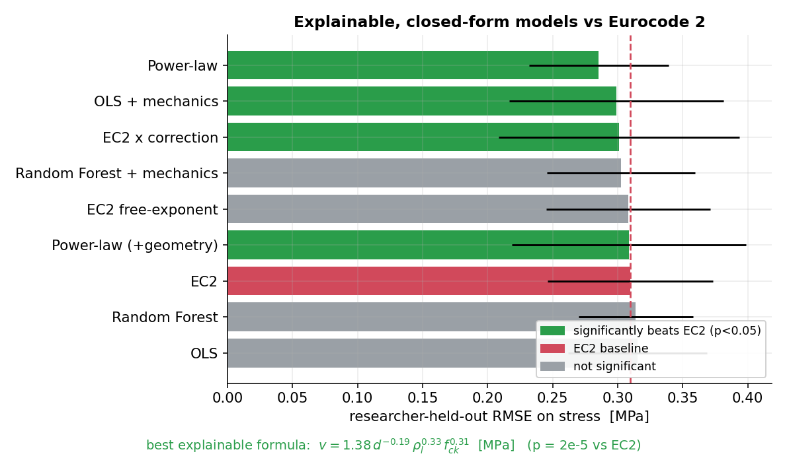
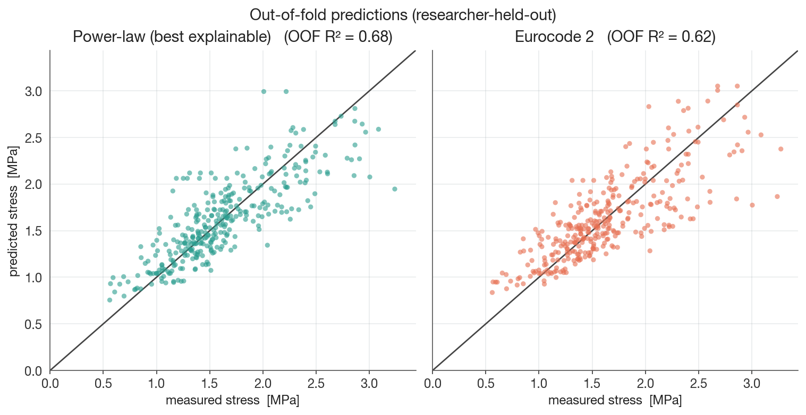

# EuroCode 2 — Enhanced Punching-Shear Formula

<div align="justify">

An interpretable machine-learning study that benchmarks — and improves on — the
**Eurocode 2 / DIN EN 1992-1-1** punching-shear design formula for reinforced-concrete
flat slabs, using **336 published laboratory tests**. It delivers transparent,
one-line equations that predict punching strength **more accurately than the code
formula under honest validation**, with the methodological rigor (no data leakage,
laboratory-grouped cross-validation, physical-unit error metrics) that data-driven
attempts in this field usually skip.

</div>

## What is punching shear? (in plain terms)

<div align="justify">

Many modern buildings use **flat slabs** — flat concrete floors resting directly on
columns, with no beams. It's economical and gives clean ceilings, but it creates a
weak spot: right where a column meets the floor, the column can **punch straight
through the slab**, like a pencil pushed through a sheet of paper. This *punching-shear*
failure is dangerous because it is **sudden and brittle** — almost no sagging or
cracking warns you first — and losing one column-to-slab connection can drop the
floor onto the one below, triggering a **progressive ("pancake") collapse** of the
whole building. It has caused real, fatal collapses.

Engineers guard against it with a design formula — here, **Eurocode 2**. That formula
is **empirical**: fitted to laboratory tests rather than derived from first
principles, and its predictions scatter widely against reality, so the code builds in
a large safety margin (on this dataset the measured strength averages **~2.3×** the
code prediction). A big margin keeps structures safe, but also makes them **heavier,
costlier, and less material-efficient** than they need to be.

**The motivation:** can modern, *interpretable* machine learning, trained on the same
laboratory tests, predict punching strength **more accurately** — shrinking that
scatter and the wasteful margin — while staying a **transparent equation an engineer
can read and check**, rather than an opaque black box? The short answer here: **yes,
modestly** — and the winning models are simple closed-form formulas that even
re-derive the physics already inside Eurocode 2.

</div>

## The Eurocode 2 formula

<div align="justify">

Eurocode 2 (EN 1992-1-1, §6.4) estimates the punching resistance of a flat slab
*without shear reinforcement* as a **shear stress** $v_{Rd,c}$ acting on a control
section around the column:

</div>

$$
v_{Rd,c} \;=\; C_{Rd,c}\,\,k\,\bigl(100\,\rho_{l}\,f_{ck}\bigr)^{1/3} \;+\; k_{1}\,\sigma_{cp}
$$

| symbol | meaning | value / notes |
|---|---|---|
| $v_{Rd,c}$ | punching resistance, expressed as a **stress** [MPa] | the quantity modelled in this project |
| $C_{Rd,c}$ | empirical calibration coefficient | $=0.18/\gamma_c$; design value $0.12$ (with safety factor $\gamma_c=1.5$) |
| $k = 1+\sqrt{200/d}\le 2.0$ | size-effect factor ($d$ in mm) | deeper slabs are proportionally weaker |
| $\rho_{l}\le 0.02$ | longitudinal (flexural) reinforcement ratio | capped at 2 % |
| $f_{ck}$ | characteristic concrete cylinder strength [MPa] | here $f_{ck}=f_{cm}-8$, clamped to classes C12/15–C90/105 |
| $k_{1}\,\sigma_{cp}$ | in-plane (prestress/normal) stress term, $k_{1}=0.1$ | **dropped** — no $\sigma_{cp}$ data in the dataset |

<div align="justify">

That stress is turned into a **failure load** through the control perimeter $u_{1}$,
taken at a distance $2d$ from the column face:

</div>

$$
V_{Rd} \;=\; v_{Rd,c}\,\cdot\,u_{1}\,\cdot\,d
$$

<div align="justify">

Since the load is mechanically proportional to the control area $u_{1}d$, this project
models the **stress** $v = V/(u_{1}d)$ directly rather than the absolute load $V$ —
which is what separates genuine punching behaviour from a trivial size effect (see
[Methodology](#methodology--the-choices-that-matter) below).

</div>

## The question, precisely

<div align="justify">

The EC2 formula carries an apparent safety factor — the genuine mean of
$V_{test}/V_{Rd}$ on this data is $\mathbf{2.28}$ — to absorb the scatter between
predicted and measured punching strength. Can interpretable ML trained on the same
physical features shrink that scatter, which features actually drive punching
behaviour, and does any improvement survive **honest, laboratory-grouped**
validation?

</div>

## Headline result

<div align="justify">

All 11 models — including the Eurocode 2 baseline — are scored on **identical
cross-validation folds**, predicting the punching **stress** $v = V/(u_{1}d)$ [MPa],
with errors in physical units. Two validation protocols tell very different
stories:

</div>



*Under random K-fold (blue) the flexible ML models beat EC2; with whole laboratories
held out (orange) the ranking collapses and EC2 leads — the apparent ML win was
lab leakage.*

**Random repeated 5×5 K-fold** (naive random splitting):

| Model | CV RMSE [MPa] | R² |
|---|---|---|
| **Random Forest** | **0.234** | **0.79** |
| SVR (RBF) | 0.252 | 0.75 |
| NLR (`d×fcm`) | 0.285 | 0.68 |
| OLS / Ridge / Lasso / ElasticNet / SVR-linear | ≈0.288 | ≈0.68 |
| Decision Tree | 0.307 | 0.63 |
| EC2 (refit `C_Rd,c`) | 0.310 | 0.63 |
| SVR (poly-3) | 0.655 | −0.90 *(overfits)* |

<div align="justify">

→ Random Forest and SVR-RBF beat EC2 (paired Wilcoxon *p* < 1e-8). This *looks*
like "ML beats Eurocode."

</div>

**Researcher-held-out GroupKFold** (whole labs held out — the honest test of
generalizing to a *new* experiment):

| Model | CV RMSE [MPa] | R² |
|---|---|---|
| **EC2 (refit `C_Rd,c`)** | **0.310** | **0.61** |
| Ridge / OLS / ElasticNet / Lasso / SVR-linear / NLR | ≈0.316 | ≈0.58 |
| Random Forest | 0.317 | 0.58 |
| SVR (RBF) | 0.362 | 0.33 |
| Decision Tree | 0.372 | 0.42 |
| SVR (poly-3) | 1.40 | −12.7 |

<div align="justify">

→ The ranking **collapses**. **No ML model out-generalizes EC2** to a new lab;
the flexible models (RBF, trees) degrade most. The apparent ML superiority under
random splits was largely **lab leakage** — with many specimens per researcher, a
random split lets flexible models memorize lab-specific offsets.

**Where ML adds value is interpretive.** On the stress target, permutation
importance shows the punching stress is driven by the **reinforcement ratio
`rho_l`** and **concrete strength `fcm_cyl`** — the actual mechanical drivers —
not by the effective depth `d` (which only appears dominant when one wrongly
predicts absolute *load*). The categorical **column profile contributes essentially
nothing**, so it could be dropped from future code formulas.

</div>



*Predicting absolute load (left) just relearns the size effect: load is mechanically
proportional to the control area `u₁·d`. The shear **stress** (right) — EC2's actual
output — is barely correlated with `d`. That is why this project models stress.*

## Methodology — the choices that matter

<div align="justify">

Honestly benchmarking an empirical formula is mostly about not fooling yourself.
The design decisions that make the comparison trustworthy:

</div>

| Decision | Why it matters |
|---|---|
| **Model the shear stress** `v = V/(u₁·d)` [MPa], not the absolute load | Load is mechanically proportional to the control area `u₁·d`, so a load model mostly relearns a trivial size effect (corr(d, load)=0.89 vs corr(d, stress)=−0.27) instead of punching physics. |
| **Report errors in physical units** (RMSE/MAE/MAPE/R² in MPa and MN) | A scaled or "per-mille" error is uninterpretable and silently incomparable across datasets and scalers. |
| **Leak-free pipelines + nested cross-validation** | The scaler and every hyper-parameter are fit *inside* each training fold and never touch held-out data — otherwise the scores come out optimistic. |
| **Laboratory-held-out (GroupKFold) validation** | The 336 tests come from 55 labs; a random split lets flexible models memorize lab-specific offsets. Holding whole labs out is the honest test of generalizing to a *new* experiment — and it is what separates a real gain from leakage. |
| **Eurocode 2 implemented from first principles** (with the `k≤2`, `ρ_l≤2%` caps) and its coefficient `C_Rd,c` re-fit per fold | Makes the baseline auditable and a fair, like-for-like competitor — validated to reproduce the reference resistance to a median error of 1e-7. |
| **Fully reproducible** — installable package, executed notebooks, a test suite | Every number and figure regenerates from a clean clone. |

## Can an *explainable* model beat EC2 — honestly? (research)

<div align="justify">

Since EC2 wins under researcher-held-out CV, the real question is whether an
**interpretable model that reduces to a neat formula** can beat it on the *honest*
bar. `scripts/run_formula_models.py` (notebook [`07`](notebooks/07_explainable_formulas.ipynb))
evaluates grey-box, symbolic and feature-engineered models on the same
researcher-held-out folds, and extracts the fitted equations.

**Yes — modestly, and only with the right structure.** Three closed-form models
beat EC2 under researcher-held-out CV at paired-Wilcoxon *p* < 0.01:

</div>

| Model | grouped RMSE [MPa] | R² | vs EC2 (Wilcoxon) |
|---|---|---|---|
| **Power-law** `v = 1.38·d^(−0.19)·rho^0.33·fck^0.31` | **0.285** | **0.67** | **p = 2e-5** |
| OLS + mechanics features | 0.299 | 0.64 | p = 1.6e-4 |
| EC2 × correction (grey-box) | 0.301 | 0.63 | p = 1.9e-4 |
| EC2 free-exponent `v=C·k·(100ρ_l·fck)^p`, p=0.31 | 0.308 | 0.61 | p = 0.36 (n.s.) |
| **EC2 (refit C_Rd,c)** | 0.310 | 0.61 | — |
| Random Forest (+features) | 0.302–0.314 | 0.59–0.63 | n.s. |
| Symbolic regression (gplearn) | 0.347 | 0.46 | n.s. |





<div align="justify">

Three findings worth keeping:

1. **The data re-derive EC2's form.** The free-exponent power-law lands at
   `rho^0.33 · fck^0.31` (≈ the EC2 cube root) and EC2-with-a-freed-exponent gives
   `p = 0.31` — *not* significantly different from `1/3`. EC2's functional form is
   **validated**; the gains come from freeing the size term (`d^(−0.19)` instead of
   the saturating `k`) and from the multiplicative structure.
2. **Structure beats flexibility.** Flexible black-boxes (RBF-SVR, deep trees, raw
   Random Forest) do **not** out-generalize EC2 here; raw symbolic regression
   (gplearn, which fits constants poorly) doesn't either. The wins are all
   low-complexity, mechanics-anchored forms.
3. **Feature engineering is the cheapest lever.** Feeding mechanics-informed inputs
   (the EC2 composite `(100·ρ_l·fck)^(1/3)`, the size factor `k`, dimensionless
   column compactness) lifts even plain OLS above EC2.

**The improvement is real but small** — RMSE ≈ −8 %, R² +0.06, with overlapping
CIs — consistent with the literature, where good symbolic/GP punching formulas
land at CoV ≈ 0.14–0.21, comparable to (not dramatically better than) EC2. The
honest takeaway: *a freed power-law with mechanics-informed features is a tidy,
slightly-better-than-EC2 design equation; a bigger model is not the lever.*

</div>

### Further levers tested (`scripts/run_levers.py`, `scripts/run_lever2_pysr.py`)

Four additional levers, each on the researcher-held-out bar (paired Wilcoxon vs EC2):

| Lever | What | Honest verdict vs EC2 | Closed form? |
|---|---|---|---|
| **3 — CSCT form** | `v = C·(100ρ_l·fck)^p / (1 + λ·d/(16+dg))` (size via aggregate denominator) | **beats EC2** on the `dg`-complete subset (R² 0.64 vs 0.60, **p = 0.02**) | yes, 1 line |
| **2 — PySR × EC2 correction** | `v = v_EC2 · [14.74/d + 0.851]` (correction discovered by PySR) | **beats EC2** (R² 0.64 vs 0.62, **p = 0.011**) | yes, 1 line |
| **1 — aggregate size `dg` as a raw feature** | add `dg` or `d/(16+dg)` to the power-law | **no gain** (n.s. / worse) | — |
| **4 — glass-box EBM / monotone GAM** | additive shape functions | **n.s. / worse** (R² 0.47–0.52) | additive curves, not 1 line |
| **2 — PySR direct** (no EC2 anchor) | free symbolic search on d, ρ_l, fck | n.s. | yes |

<div align="justify">

This **sharpens the same lesson**: what beats EC2 is *mechanics-anchored structure*
— the CSCT size-aggregate form (3) and the EC2-anchored PySR correction (2), both
neat one-line formulas. What does **not** help is adding raw signal without
structure (1) or adding model flexibility (4: EBM/GAM, like RF/SVR earlier, only
tie or trail EC2). Notably the CSCT fit again returns a material exponent
`p ≈ 0.33` — the cube root keeps re-appearing. Gains stay modest (R² +0.03–0.06),
consistent with the literature ceiling (CoV ≈ 0.14–0.21).

**Net:** the strongest explainable challengers to EC2 are the **free-exponent
power-law** (full data, p = 2e-5), the **CSCT aggregate-size form** (where `dg` is
known), and the **PySR/grey-box EC2 correction**. All are one-line, code-style
equations. *Reproduce:* `python scripts/run_levers.py` (levers 1/3/4) and
`python scripts/run_lever2_pysr.py` (lever 2; needs the PySR Julia backend —
`pip install -e ".[pysr]"`).

</div>

## Repository layout

```
sciml-punching-shear/
├── punching_shear/            # the reusable, leak-free package
│   ├── data.py                #   load/clean; stress target; researcher groups; fck caps
│   ├── eurocode.py            #   EC2 stress formula (+caps), refit C_Rd,c, EC2Regressor
│   ├── evaluation.py          #   physical-unit metrics (stress & load), shared folds, paired tests
│   ├── models.py              #   11-model zoo + explainable/formula model set
│   ├── features.py            #   mechanics-informed feature engineering
│   ├── greybox.py             #   power-law, EC2 free-exponent, EC2 x correction, CSCT form
│   ├── glassbox.py            #   EBM + monotone GAM (lever 4)
│   └── symbolic.py            #   gplearn + PySR symbolic regression (+ sklearn>=1.6 shim)
├── scripts/
│   ├── run_analysis.py        # main study -> results/ tables + figures  (~9 min)
│   ├── run_formula_models.py  # explainable/formula models vs EC2 -> results/formula_* (~3 min)
│   ├── run_levers.py          # levers 1/3/4 (aggregate dg, CSCT, EBM/GAM) vs EC2
│   ├── run_lever2_pysr.py     # lever 2 (PySR correction); needs the Julia backend
│   ├── make_readme_figures.py # regenerate the figures in assets/
│   └── build_notebooks.py     # regenerate the notebooks from the package
├── notebooks/                 # clean, executed notebooks (01-08)
├── assets/                    # committed figures used in this README
├── results/                   # generated CSV tables + PNG figures (git-ignored; run the scripts)
├── tests/                     # pytest sanity/guard suite
├── data/                      # Daten_Siburg.xlsx (raw, +Forscher), Data.xlsx (+control area)
├── pyproject.toml             # installable package + optional extras
└── requirements.txt
```

## Quick start

```bash
python -m venv .venv && source .venv/bin/activate
pip install -e ".[notebooks,dev]"      # package + jupyter/seaborn + pytest

pytest -q                              # 13 guard tests (~25 s)
python scripts/run_analysis.py         # main study -> results/  (~9 min, nested CV)
python scripts/run_formula_models.py   # explainable-formula study -> results/  (~3 min)
jupyter lab notebooks/                 # the narrative, 01 -> 08
```

<div align="justify">

The package resolves data paths relative to itself, so notebooks and scripts work
from a fresh clone without path edits.

</div>

## Dataset

<div align="justify">

336 published flat-slab punching tests compiled by Dr. Karl Friedrich Siburg.
Modelling uses five fully-observed features — effective depth `d` [mm], column
area `col_area` [mm²], reinforcement ratio `rho_l` [%], cylinder strength
`fcm_cyl` [MPa], and load perimeter `u0_perim` [m] — to predict the punching
**stress** `v_test` [MPa]. The companion `Data.xlsx` supplies the EC2 control
area $\beta = u_{1}d$, so $v = V_{test}\cdot 10^{6}/\beta$. `Forscher` (source lab)
drives the grouped CV; `dg`, `fym`, `Esm`, `c2` are dropped (heavily missing). The
EC2 baseline formula and its parameters are defined in
[The Eurocode 2 formula](#the-eurocode-2-formula). See
[`data/README.md`](data/README.md).

</div>

## Extending this work

- Add `dg`, `fym`, `Esm` back with proper imputation rather than dropping them.
- Fit the **exponents** of the EC2 form (true grey-box SciML), not just `C_Rd,c`.
- Physics-informed regularization toward the EC2 functional form.
- Broaden the dataset beyond interior columns (edge/corner, footings) so the
  grouped-CV generalization test spans the cases EC2 actually differentiates.

## Eurocode 2 vs. the enhanced formula

<div align="justify">

Both are one-line, engineer-checkable equations for the punching **stress** [MPa].
The data-driven fit **re-derives** Eurocode 2's cube-root dependence on $\rho_l$ and
$f_{ck}$ (the fitted exponents land at $0.33$ and $0.31\approx\tfrac{1}{3}$) and only
reshapes the size term — yet it generalizes better under laboratory-held-out
validation.

</div>

$$
\begin{array}{c|c}
\textbf{Eurocode 2 (baseline)} & \textbf{Enhanced (this work)} \\
\hline
v_{Rd,c} = C_{Rd,c}\,k\,\bigl(100\,\rho_l\,f_{ck}\bigr)^{1/3} & v = 1.38\,d^{-0.19}\,\rho_l^{0.33}\,f_{ck}^{0.31} \\
k = 1+\sqrt{200/d}\le 2,\ \text{fixed } \tfrac{1}{3} & \text{free exponents } 0.33,\,0.31 \approx \tfrac{1}{3} \\
\text{honest CV: } R^2 = 0.61 & \text{honest CV: } R^2 = 0.67\ (p = 2\times10^{-5})
\end{array}
$$

## License

MIT — see [`LICENSE`](LICENSE).
