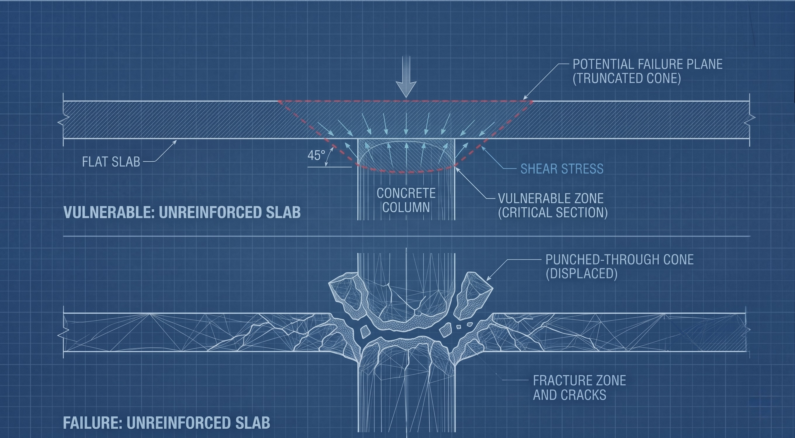

# Eurocode 2 Enhanced Punching-Shear Formula

<div align="justify">

An interpretable machine-learning study that benchmarks, and improves on, the
**Eurocode 2 (DIN EN 1992-1-1)** punching-shear design formula for reinforced-concrete
flat slabs, using **336 published laboratory tests**. It delivers transparent,
one-line equations that predict punching strength more accurately than the code
formula under honest validation, with the methodological rigor (no data leakage,
laboratory-grouped cross-validation, physical-unit error metrics) that data-driven
attempts in this field usually skip.

</div>

## TL;DR

- **Goal:** can interpretable ML, trained on the same lab tests, beat the Eurocode 2
  punching formula while staying a transparent equation an engineer can check?
- **The catch most studies miss:** under naive random data splits, ML looks far
  better than Eurocode 2. Under honest, laboratory-held-out validation that apparent
  win **disappears** (it was data leakage). No standard ML model out-generalizes the
  code.
- **What does work:** a tidy, free-exponent **power-law** (plus a couple of
  physics-anchored variants) that **modestly but significantly** beats Eurocode 2 on
  the honest test, and even re-derives the code's cube-root structure.
- **Deliverable:** $v = 1.38\cdot d^{-0.19}\cdot \rho_l^{0.33}\cdot f_{ck}^{0.31}$ [MPa], lifting
  honest-CV R² from 0.61 to 0.67.


**Contents:**
[What is punching shear?](#what-is-punching-shear) ·
[The Eurocode 2 formula](#the-eurocode-2-formula) ·
[Does ML beat Eurocode 2?](#does-ml-beat-eurocode-2) ·
[An honest, interpretable formula](#an-honest-interpretable-formula) ·
[Methodology](#methodology) ·
[Reproduce](#reproduce) ·
[Dataset](#dataset) ·
[Roadmap](#roadmap)

## What is punching shear?

<div align="justify">

Many modern buildings use **flat slabs**: flat concrete floors resting directly on
columns, with no beams. It is economical and gives clean ceilings, but it creates a
weak spot. Right where a column meets the floor, the column can **punch straight
through the slab**, like a pencil pushed through a sheet of paper. This punching-shear
failure is dangerous because it is **sudden and brittle** (almost no sagging or
cracking warns you first), and losing one column-to-slab connection can drop the
floor onto the one below, triggering a **progressive ("pancake") collapse** of the
whole building. It has caused real, fatal collapses.

</div>



*An unreinforced flat slab: shear stress concentrates around the column on a roughly
45-degree critical section (top); once it exceeds capacity, the column punches a
truncated cone straight through the slab (bottom).*

<div align="justify">

Engineers guard against it with a design formula; here, **Eurocode 2**. That formula
is **empirical**: fitted to laboratory tests rather than derived from first
principles, and its predictions scatter widely against reality, so the code builds in
a large safety margin (on this dataset the measured strength averages about **2.3x**
the code prediction). A big margin keeps structures safe, but also makes them
**heavier, costlier, and less material-efficient** than they need to be. Predicting
punching strength more accurately would let that margin shrink.

</div>

## The Eurocode 2 formula

<div align="justify">

Eurocode 2 (EN 1992-1-1, §6.4) estimates the punching resistance of a flat slab
*without shear reinforcement* as a **shear stress** $v_{Rd,c}$ acting on a control
section around the column:

</div>

$$
v_{Rd,c} = C_{Rd,c}\cdot k\cdot\bigl(100\cdot\rho_{l}\cdot f_{ck}\bigr)^{1/3} + k_{1}\cdot\sigma_{cp}
$$

| symbol | meaning | value / notes |
|---|---|---|
| $v_{Rd,c}$ | punching resistance, expressed as a **stress** [MPa] | the quantity modelled in this project |
| $C_{Rd,c}$ | empirical calibration coefficient | $=0.18/\gamma_c$; design value $0.12$ (with safety factor $\gamma_c=1.5$) |
| $k = 1+\sqrt{200/d}\le 2.0$ | size-effect factor ($d$ in mm) | deeper slabs are proportionally weaker |
| $\rho_{l}\le 0.02$ | longitudinal (flexural) reinforcement ratio | capped at 2 % |
| $f_{ck}$ | characteristic concrete cylinder strength [MPa] | here $f_{ck}=f_{cm}-8$, clamped to classes C12/15 to C90/105 |
| $k_1\sigma_{cp}$ | in-plane (prestress/normal) stress term, $k_1=0.1$ | **dropped**: no $\sigma_{cp}$ data in the dataset |

<div align="justify">

That stress becomes a **failure load** through the control perimeter $u_{1}$, taken
at a distance $2d$ from the column face: $V_{Rd} = v_{Rd,c}\cdot u_{1}\cdot d$. Since
the load is mechanically proportional to the control area $u_{1}d$, this project
models the **stress** $v = V/(u_{1}d)$ directly rather than the absolute load $V$.
That choice is what separates genuine punching behaviour from a trivial size effect:

</div>


## Does ML beat Eurocode 2?

<div align="justify">

Only if you let it cheat. All 11 models (including the Eurocode 2 baseline) are scored
on **identical cross-validation folds**, predicting the punching stress in physical
units. The two validation protocols tell opposite stories (the hero figure at the top
shows this at a glance):

</div>

**1. Naive random K-fold (optimistic):**

| Model | CV RMSE [MPa] | R² |
|---|---|---|
| **Random Forest** | **0.234** | **0.79** |
| SVR (RBF) | 0.252 | 0.75 |
| OLS / Ridge / Lasso / NLR / SVR-linear | about 0.288 | about 0.68 |
| EC2 (refit $C_{Rd,c}$) | 0.310 | 0.63 |

Random Forest and SVR-RBF beat EC2 (paired Wilcoxon $p < 10^{-8}$). This *looks* like
"ML beats Eurocode."

**2. Researcher-held-out GroupKFold (honest):** whole labs held out, the real test of
generalizing to a *new* experiment.

| Model | CV RMSE [MPa] | R² |
|---|---|---|
| **EC2 (refit $C_{Rd,c}$)** | **0.310** | **0.61** |
| linear family (OLS, Ridge, ...) | about 0.316 | about 0.58 |
| Random Forest | 0.317 | 0.58 |
| SVR (RBF) | 0.362 | 0.33 |

<div align="justify">

The ranking **collapses**: no ML model out-generalizes EC2 to a new lab, and the
flexible models (RBF, trees) degrade most. The apparent ML superiority was largely
**lab leakage**: with many specimens per researcher, a random split lets flexible
models memorize lab-specific offsets. (`SVR (poly-3)` is omitted from the tables; it
overfits to a negative R².)

**Where ML does add value is interpretive.** On the stress target, permutation
importance shows the punching stress is driven by the **reinforcement ratio**
`rho_l` and **concrete strength** `fcm_cyl`, the actual mechanical drivers, not by the
effective depth `d` (which only appears dominant when one wrongly predicts absolute
load). The categorical column profile contributes essentially nothing, so it could be
dropped from future code formulas.

</div>

## An honest, interpretable formula

<div align="justify">

Since EC2 wins under honest validation, the real question is whether an
**interpretable model that reduces to a neat formula** can beat it on that bar.
Grey-box, symbolic, and feature-engineered models, all evaluated on the same
researcher-held-out folds, give a clear answer: **yes, modestly, and only with the
right structure.** Three closed-form models beat EC2 at paired-Wilcoxon $p < 0.01$.

</div>


| Model | grouped RMSE [MPa] | R² | vs EC2 |
|---|---|---|---|
| **Power-law** $v = 1.38\cdot d^{-0.19}\cdot \rho_l^{0.33}\cdot f_{ck}^{0.31}$ | **0.285** | **0.67** | $p = 2\times10^{-5}$ |
| OLS + mechanics features | 0.299 | 0.64 | $p = 1.6\times10^{-4}$ |
| EC2 x correction (grey-box) | 0.301 | 0.63 | $p = 1.9\times10^{-4}$ |
| EC2 (refit $C_{Rd,c}$) | 0.310 | 0.61 | baseline |
| Random Forest / EBM / GAM / symbolic | 0.30 to 0.35 | 0.46 to 0.63 | not significant |

The best explainable challenger, side by side with the code formula:

$$
\begin{array}{c|c}
\textbf{Eurocode 2 (baseline)} & \textbf{Enhanced (this work)} \\
\hline
v_{Rd,c} = C_{Rd,c}\cdot k\cdot\bigl(100\cdot\rho_l\cdot f_{ck}\bigr)^{1/3} & v = 1.38\cdot d^{-0.19}\cdot\rho_l^{0.33}\cdot f_{ck}^{0.31} \\
k = 1+\sqrt{200/d}\le 2,\ \text{fixed } \tfrac{1}{3} & \text{free exponents } 0.33,\ 0.31 \approx \tfrac{1}{3} \\
\text{honest CV: } R^2 = 0.61 & \text{honest CV: } R^2 = 0.67\ (p = 2\times10^{-5})
\end{array}
$$


<div align="justify">

Two themes hold across every result. First, **the data re-derive Eurocode 2's form**:
the fitted exponents on `rho_l` and `fck` land at 0.33 and 0.31, both close to the
code's cube root, and freeing that exponent gives $p \approx 1/3$ (not significantly
different from EC2). The code's functional form is validated; the gains come from
freeing the size term and from a multiplicative structure. Second, **structure beats
flexibility**: flexible black boxes (RBF-SVR, deep trees, raw symbolic regression) do
not out-generalize EC2, while low-complexity, mechanics-anchored forms do. The
improvement is real but modest (RMSE about 8 % lower, R² up 0.06), consistent with the
literature, where good symbolic/GP punching formulas land at CoV about 0.14 to 0.21.

</div>

<details>
<summary><b>Further levers explored (aggregate size, CSCT form, glass-box, PySR)</b></summary>

<br>

Four additional levers, each on the researcher-held-out bar (paired Wilcoxon vs EC2):

| Lever | What | Honest verdict | Closed form? |
|---|---|---|---|
| **CSCT form** | $v = C\cdot(100\rho_l f_{ck})^{p} / (1 + \lambda\cdot d / (16+dg))$ (size via aggregate denominator) | **beats EC2** on the `dg`-complete subset ($p = 0.02$) | yes, 1 line |
| **PySR x EC2 correction** | $v = v_{EC2}\cdot[14.74/d + 0.851]$ (correction found by PySR) | **beats EC2** ($p = 0.011$) | yes, 1 line |
| aggregate size `dg` as a raw feature | add `dg` or `d/(16+dg)` to the power-law | no gain | (no) |
| glass-box EBM / monotone GAM | additive shape functions | not significant | additive curves |
| PySR direct (no EC2 anchor) | free symbolic search | not significant | yes |

Same lesson, sharpened: what beats EC2 is *mechanics-anchored structure* (the CSCT
size-aggregate form and the EC2-anchored PySR correction, both one-line formulas).
Adding raw signal without structure, or adding model flexibility, does not help.
Notably the CSCT fit again returns a material exponent near 1/3. Reproduce with
`python scripts/run_levers.py` and `python scripts/run_lever2_pysr.py`.

</details>

## Methodology

<div align="justify">

Honestly benchmarking an empirical formula is mostly about not fooling yourself. The
design decisions that make the comparison trustworthy:

</div>

<details>
<summary><b>The choices that matter (and why)</b></summary>

<br>

| Decision | Why it matters |
|---|---|
| **Model the shear stress** $v = V/(u_1 d)$, not the absolute load | Load is proportional to the control area $u_1 d$, so a load model mostly relearns a trivial size effect (corr(d, load) = 0.89 vs corr(d, stress) = -0.27) instead of punching physics. |
| **Report errors in physical units** (RMSE/MAE/MAPE/R² in MPa and MN) | A scaled or "per-mille" error is uninterpretable and silently incomparable across datasets and scalers. |
| **Leak-free pipelines + nested cross-validation** | The scaler and every hyper-parameter are fit *inside* each training fold and never touch held-out data; otherwise the scores come out optimistic. |
| **Laboratory-held-out (GroupKFold) validation** | The 336 tests come from 55 labs; a random split lets flexible models memorize lab-specific offsets. Holding whole labs out is the honest test of generalizing to a *new* experiment. |
| **Eurocode 2 implemented from first principles** (with the $k\le2$, $\rho_l\le0.02$ caps) and its coefficient re-fit per fold | Makes the baseline auditable and a fair, like-for-like competitor; validated to reproduce the reference resistance to a median error of $10^{-7}$. |
| **Fully reproducible** (installable package, executed notebooks, a test suite) | Every number and figure regenerates from a clean clone. |

</details>

## Reproduce

```bash
python -m venv .venv && source .venv/bin/activate
pip install -e ".[notebooks,dev]"      # package + jupyter/seaborn + pytest

pytest -q                              # 17 guard tests
python scripts/run_analysis.py         # main study -> results/ (about 9 min)
python scripts/run_formula_models.py   # explainable-formula study -> results/ (about 3 min)
jupyter lab notebooks/                 # the narrative, 01 to 08
```

<div align="justify">

The package resolves data paths relative to itself, so notebooks and scripts work
from a fresh clone without path edits. Generated tables and figures land in
`results/` (git-ignored); regenerate the README figures with
`python scripts/make_readme_figures.py`.

</div>

<details>
<summary><b>Repository layout</b></summary>

```
EuroCode2-Enhanced-Punching-Shear-Formula/
├── punching_shear/            # the reusable, leak-free package
│   ├── data.py                #   load/clean; stress target; researcher groups; fck caps
│   ├── eurocode.py            #   EC2 stress formula (+caps), refit C_Rd,c, EC2Regressor
│   ├── evaluation.py          #   physical-unit metrics (stress & load), shared folds, paired tests
│   ├── models.py              #   11-model zoo + explainable/formula model set
│   ├── features.py            #   mechanics-informed feature engineering
│   ├── greybox.py             #   power-law, EC2 free-exponent, EC2 x correction, CSCT form
│   ├── glassbox.py            #   EBM + monotone GAM
│   └── symbolic.py            #   gplearn + PySR symbolic regression
├── scripts/                   # run_analysis, run_formula_models, run_levers, make_readme_figures, ...
├── notebooks/                 # clean, executed notebooks (01 to 08)
├── assets/                    # committed figures used in this README
├── results/                   # generated CSVs + figures (git-ignored; run the scripts)
├── tests/                     # pytest sanity/guard suite
├── data/                      # Daten_Siburg.xlsx (raw, +Forscher), Data.xlsx (+control area)
└── pyproject.toml             # installable package + optional extras
```

</details>

## Dataset

<div align="justify">

336 published flat-slab punching tests compiled by Dr. Karl Friedrich Siburg.
Modelling uses five fully-observed features (effective depth `d` [mm], column area
`col_area` [mm²], reinforcement ratio `rho_l` [%], cylinder strength `fcm_cyl` [MPa],
and load perimeter `u0_perim` [m]) to predict the punching stress `v_test` [MPa]. The
companion `Data.xlsx` supplies the EC2 control area $\beta = u_1 d$, so
$v = V_{test}\cdot 10^{6}/\beta$. `Forscher` (source lab) drives the grouped CV;
`dg`, `fym`, `Esm`, `c2` are dropped (heavily missing). See
[`data/README.md`](data/README.md) for the full data dictionary.

</div>

## Roadmap

- Add `dg`, `fym`, `Esm` back with proper imputation rather than dropping them.
- Fit the **exponents** of the EC2 form end to end (true grey-box SciML), not just $C_{Rd,c}$.
- Physics-informed regularization toward the EC2 functional form.
- Broaden the dataset beyond interior columns (edge/corner, footings) so the
  grouped-CV generalization test spans the cases EC2 actually differentiates.

## License

MIT, see [`LICENSE`](LICENSE).
